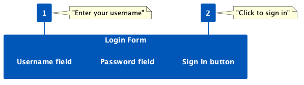
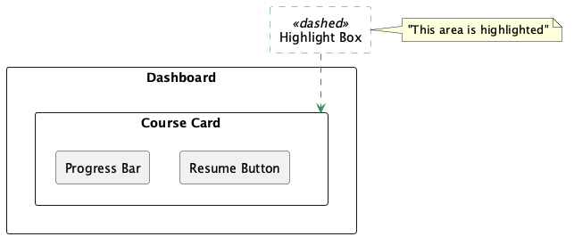
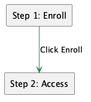

# Moove Education Platform – Screenshot Branding & Annotation Guide

All screenshots used in the User Guide, SRS, SDD, and other documents must adhere to this specification to ensure consistency and professionalism.

## 1. General Principles
- **Clarity**: Annotations must make the UI element or workflow immediately obvious.
- **Consistency**: Use the same style for all callouts, arrows, and highlights.
- **Confidentiality**: Blur or obscure any personal identifiable information (PII) such as real user emails, names, and profile pictures.

## 2. Color Palette (Company Branding)

| Usage | Color Name | Hex Code | RGB | Visual |
|-------|------------|----------|-----|--------|
| **Primary** – Callout Backgrounds, Headers, Primary Buttons | Moove Blue | `#0057B8` | (0, 87, 184) |  |
| **Secondary** – Highlights, Arrows, Emphasized Elements | Moove Green | `#2E8B57` | (46, 139, 87) |  |
| **Tertiary** – Text on Primary/Secondary backgrounds, Clean backgrounds | White | `#FFFFFF` | (255,255,255) | White |
| **Neutral** – Dark text on light backgrounds (if needed) | Dark Gray | `#1A1A1A` | (26,26,26) | Dark gray |

## 3. Annotation Styles

### 3.1 Numbered Callouts (for step-by-step workflows)

- **Shape**: Circle (diameter 24px) or Rounded Rectangle (24px height).
- **Fill**: Moove Blue (`#0057B8`).
- **Text**: White (`#FFFFFF`), bold, size 12px (or 14px if scaled).
- **Placement**: Place directly on or right next to the target UI element.
- **Connecting Line**: Optional thin line (Moove Blue, stroke 1px) pointing to the exact element.

**Example:**

### 3.2 Highlight Boxes

- **Shape**: Rounded rectangle with dashed stroke.
- **Stroke**: Moove Green (`#2E8B57`), 2px width, 4px dash.
- **Fill**: None (transparent).

**Example:**

### 3.3 Arrows

- **Color**: Moove Green (`#2E8B57`).
- **Stroke**: 2px width.
- **Style**: Solid line with standard arrowhead.

**Example:**

### 3.4 Blurring / Redaction
- **Method**: Apply a Gaussian blur (radius ~15-20px) OR a black/gray rectangle with 40% opacity.
- **Targets**: Email addresses, real names, profile photos, API keys, or any confidential data.

## 4. Resolution & Dimensions
- **Image Size**: Keep the original resolution (typically 1920x1080 or scaled proportionally).
- **Export**: Save as **PNG** with high quality (lossless).
- **Scaling**: If the image needs to fit the LaTeX page width, scale it down post-annotation. Do not upscale low-res images.

## 5. Figma Template (Recommended)
1. Create a new Figma file.
2. Import the raw screenshot.
3. Create a component set for "Callout", "Highlight Box", and "Arrow" using the specs above.
4. Reuse these components across all screenshots.

## 6. Acceptance Criteria for Screenshot Tasks
- [ ] All annotations use the correct colors (Moove Blue for callouts, Moove Green for highlights/arrows).
- [ ] All PII is blurred/redacted.
- [ ] Numbered steps are sequential and logical.
- [ ] The screenshot directly supports the adjacent text in the User Guide.
- [ ] The image file is saved as PNG and overwrites the original.

---
*This guide is mandatory for all editors. Deviations must be approved by the project lead.*